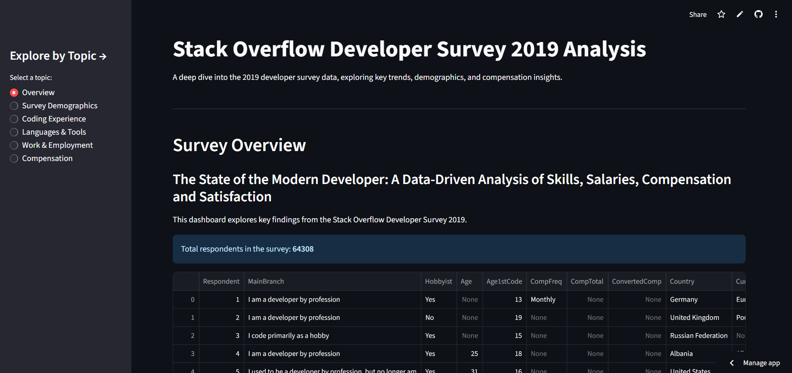

# Stack Overflow Survey
Key Trends in the Global Developer Community: A Data-Driven Analysis

# 🌍 Stack Overflow Survey Dashboard

An interactive Streamlit app analyzing global developer trends, employment, and work-life insights using the **Stack Overflow Developer Survey**.

🔗 **Live App**: [Click here to explore](https://stack-overflow-survey-ma2s9e0e9r0a2.streamlit.app/)

---

## 📸 Preview

---

## 🚀 Features
- Employment type distribution  
- Average working hours by continent  
- Top developer roles & gender insights  
- Country-wise job satisfaction trends  

---

## 🛠️ Tech Stack
- Python (Pandas, NumPy)  
- Streamlit  
- Plotly / Matplotlib  
